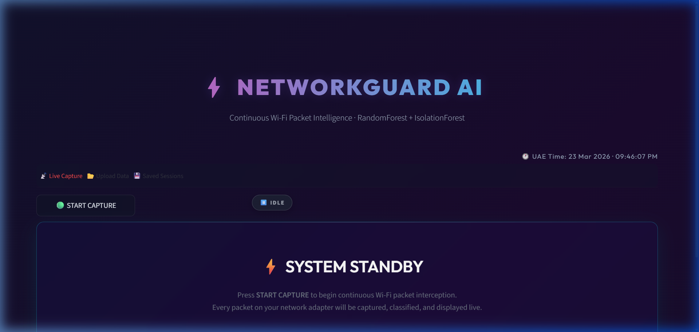
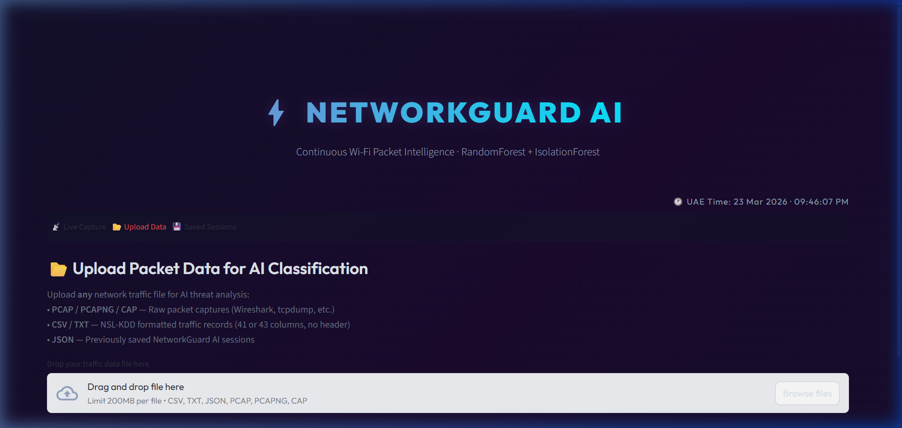
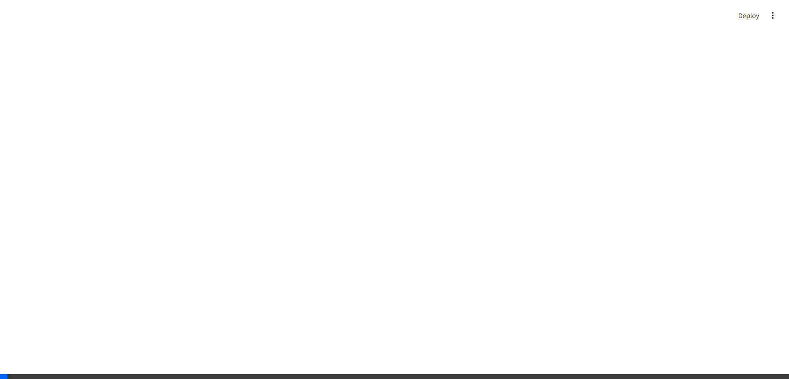

# ⚡ NetworkGuard AI


NetworkGuard AI is a state-of-the-art **Network Anomaly Detection System (NADS)** designed to operate as a live, tactical Security Operations Center (SOC) dashboard. By utilizing advanced Machine Learning techniques, the application continuously intercepts network traffic, actively categorizing live packets to instantly flag cyber threats like Denial-of-Service (DoS), Probe, R2L, and U2R attacks.

I built this project to provide rapid, highly-visual network intelligence through an intuitive **Glassmorphism-styled UI**.

---

## 📸 Interface Showcases

### Live Packet Intelligence
The main SOC dashboard processes live packets from your network interface in real-time, displaying threat risk KPIs, protocol volume, and a rolling 3D PCA cluster map of live network anomalies.


### Automated Forensic Uploads
Easily upload PCAP files, JSON session captures, or CSV traffic records. The application automatically triggers deep feature extraction to generate a full incident report.


### AI Navigation Demo


---

## 🚀 Key Features

*   **Continuous Packet Interception:** Captures packets live from your core network interface using `scapy` using non-blocking multi-threading.
*   **Dual-Model AI Engine:** Combines a **RandomForest Classifier** (trained on NSL-KDD for known threat signatures) with an **Isolation Forest** (for zero-day unclassified anomaly detection).
*   **Deep Forensic Inspector:** When analyzing PCAP batches, the tool rips through layers of traffic to decrypt/extract SNIs, Kerberos Usernames, LDAP names, and HTTP User-Agents.
*   **Generate Mock Threats:** Includes a built-in one-click **"Generate Synthetic Threats"** button to simulate 5000 rows of blended Normal/Attack traffic to see the AI models at work immediately.
*   **Save & Manage Sessions:** Live captured data can be exported at any time into an immutable `.json` state. Sessions can be re-loaded for review or deleted via the UI.
*   **Modern Glassmorphism Design:** A highly immersive animated UI theme featuring frosted backdrop panels, cyber-glow alerts, auto-updating charts, and premium typography.

## 📦 Tech Stack

- **Machine Learning Layer:** Scikit-Learn (`RandomForestClassifier`, `IsolationForest`, `PCA`), Joblib for serialized speed.
- **Data Engineering:** Pandas, Numpy, Scapy (Live extraction).
- **Frontend / Visualization:** Streamlit (Core app), Plotly (3D PCA, Area/Bar charts).

## ⚙️ Quickstart

1. Clone and Install Dependencies:
```bash
pip install -r requirements.txt
```

2. Download Dataset:
```bash
python download_data.py
```

3. Train the Base Detection Models:
```bash
python train_models.py
```

4. Launch the Tactical Dashboard:
```bash
streamlit run app.py
```

## 🛡️ Usage Instructions

Once the Streamlit interface loads (default `http://localhost:8501`), you have three paths:
1. **Live Capture:** Click **START CAPTURE** on the first tab. NetworkGuard AI will bind to your primary network adapter and begin mapping packets in 3D space, alerting you to anything anomalous.
2. **PCAP Forensics:** Go to the **Upload Data** tab to drop a `.pcap` or `.pcapng` file. The core engine will rebuild the network flows dynamically, run feature extraction, flag malicious IPs, and generate an exported Incident Report text file.
3. **Synthetic Test:** Under **Upload Data**, hit **"Generate Synthetic Threats"** to pump historical test data directly into the classification engine.
